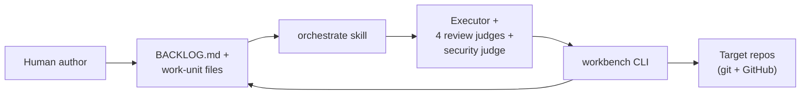
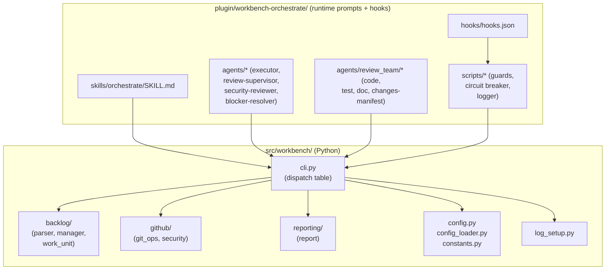
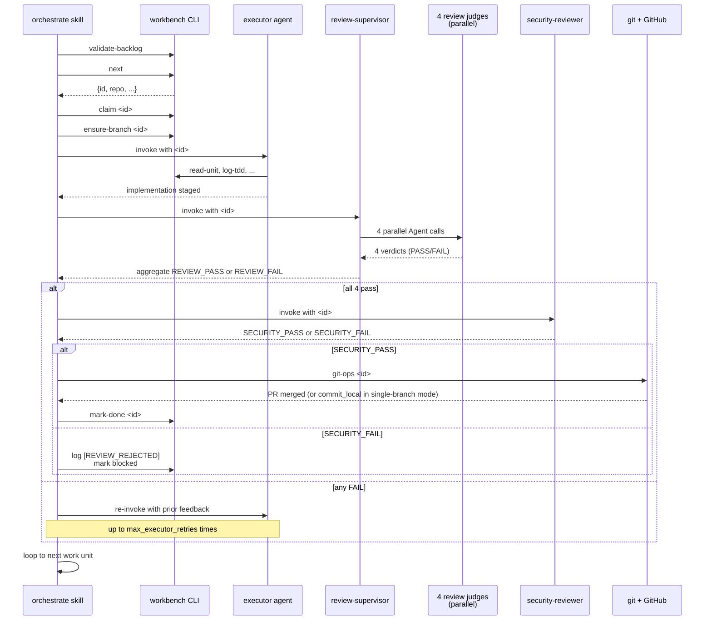
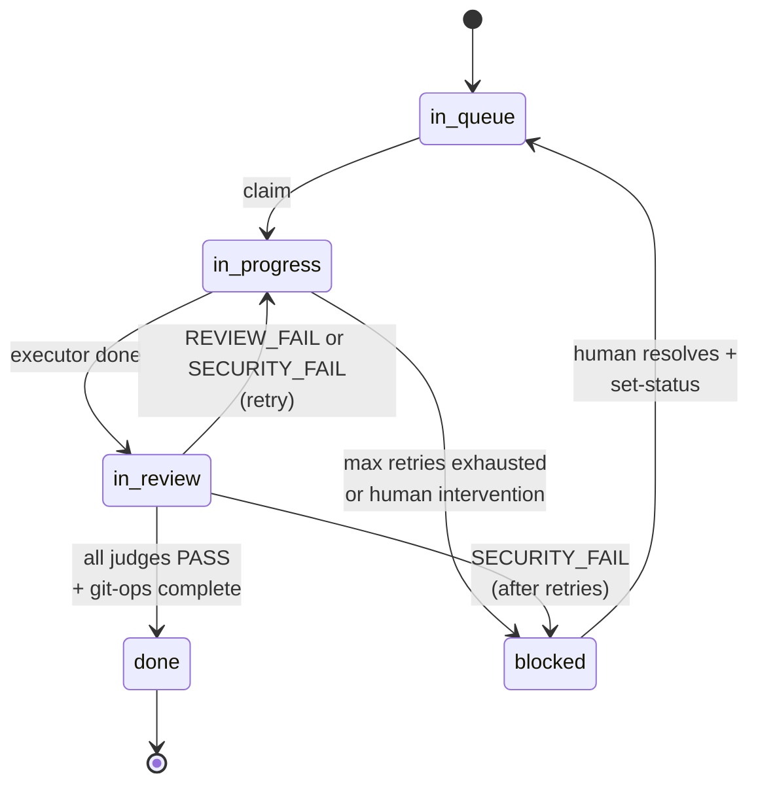
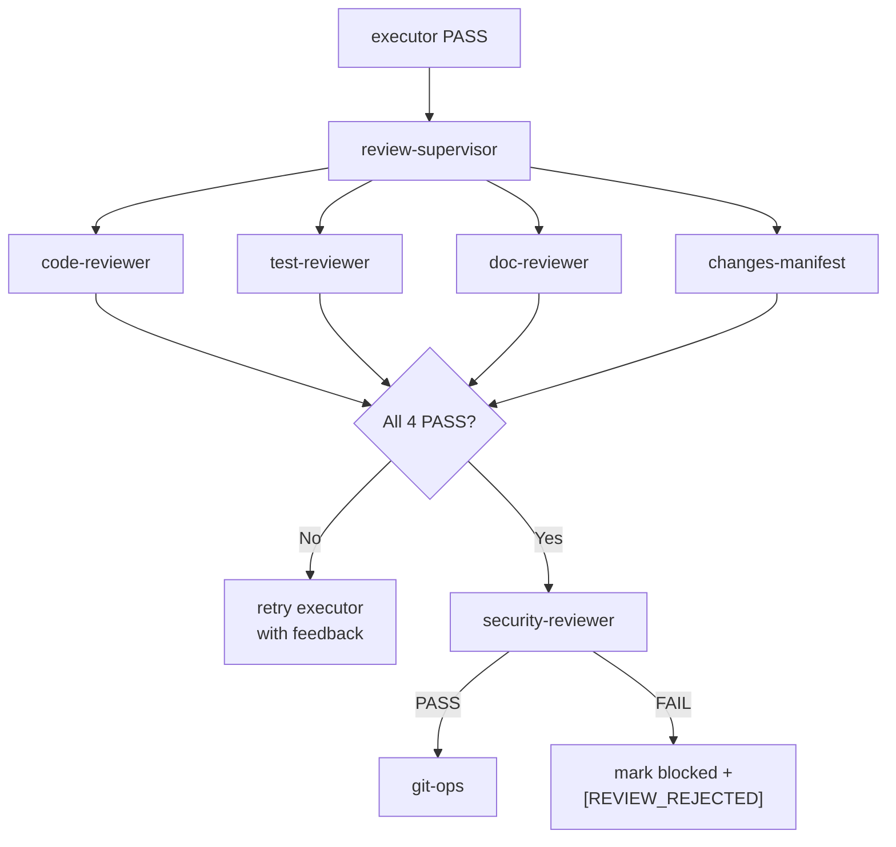
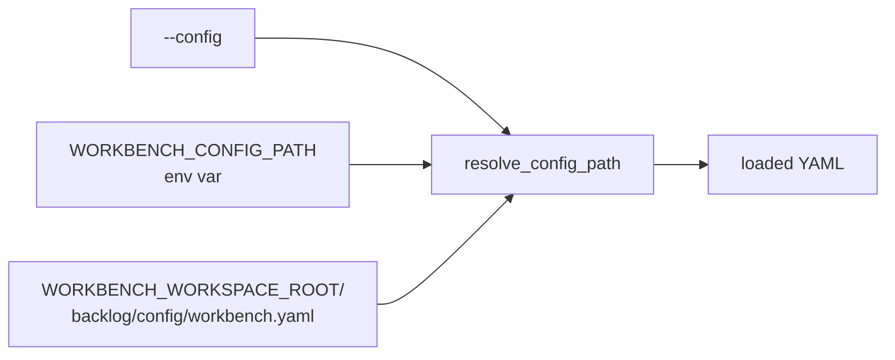

# Workbench Architecture

The single doc that explains how workbench works end-to-end. Read this first if you are new to the project, need to explain workbench to a stakeholder, or are about to make a non-trivial change.

This doc covers what workbench does today, how it is constructed, how the orchestration loop runs, how multiple repos and PR modes are configured, how the judge tier works (and how to swap a judge), the configuration model, the hooks layer, current gaps, known issues queued for separate fixes, a glossary, and links to the other docs that cover individual pieces in depth.

---

## Table of contents

- [1. Overview](#1-overview)
- [2. Capabilities](#2-capabilities)
- [3. Construction (components)](#3-construction-components)
- [4. Process flow (orchestration loop)](#4-process-flow-orchestration-loop)
- [5. Multi-repo vs single-repo](#5-multi-repo-vs-single-repo)
- [6. Multi-PR vs single-PR mode](#6-multi-pr-vs-single-pr-mode)
- [7. Judge architecture & how to swap judges](#7-judge-architecture--how-to-swap-judges)
- [8. Configuration model](#8-configuration-model)
- [9. Hooks layer](#9-hooks-layer)
- [10. Current gaps (known limitations)](#10-current-gaps-known-limitations)
- [11. Known issues to address separately](#11-known-issues-to-address-separately)
- [12. Glossary](#12-glossary)
- [13. See also](#13-see-also)

---

## 1. Overview

Workbench takes a structured backlog of work units (epics → features → stories → tasks) and drives them autonomously through a TDD implement / parallel-judge-review / security-review / git-merge pipeline. LLM agents do the implementation and reviews; a Claude Code skill (`orchestrate`) coordinates them; a Stop hook prevents context-compaction stalls so the loop survives long unattended runs.

The human role is to write the specification and the work-unit backlog. Everything from "claim the next task" to "merge the PR" runs without human intervention.



The arrows back to BACKLOG.md represent status writes and audit comments -- every action by every agent is recorded in the work unit file's `## Comments` section so the loop can resume from any point after a restart.

---

## 2. Capabilities

What workbench does today, grouped by theme:

### Autonomous SDLC pipeline
- End-to-end backlog processing: spec → claim → implement (TDD) → 4-judge review → security review → commit → PR → CI → merge → mark-done → loop.
- No human-in-the-loop required for routine decisions.
- Recursive work-unit hierarchy (Epic → Feature → Story → Task) with automatic status rollup of parents when children complete.

### Multi-judge review
- Four review judges (code, test, doc, changes-manifest) run in parallel via `review-supervisor`. The supervisor is **read-only**: a PreToolUse hook (`plugin/workbench-orchestrate/scripts/guard-review-supervisor-scope.sh`) blocks any Bash mutation (git commit/push, rm, sed -i, etc.) AND any Agent-tool invocation whose `subagent_type` is outside the canonical review_team allowlist (`workbench:code_review`, `workbench:test_review`, `workbench:doc_review`, `workbench:changes_manifest`). This closes the loophole where the supervisor previously escalated to commit / push / PR-create rights by spawning an executor subagent (issue #118).
- A separate security judge runs sequentially after the review tier passes.
- Done-gate enforces all four review judges must REVIEW_PASS before a unit can be marked done.
- Review failures inject prior feedback into the next executor attempt to prevent loops.
- A fifth, conditional judge (`manifest-amender`) runs before `review-supervisor` when an executor-emitted amendment request file is pending. On approval the amender invokes `apply-amendment`, which atomically updates the Changes Manifest and runs a deterministic Layer 3 post-check (em-dash scan plus `validate-backlog`) with rollback on any failure. Opt-in via `manifest_amendment.enabled: true` in `backlog/config/workbench.yaml`; see [authoring-manifests.md](authoring-manifests.md) and [manifest-amendments.md](manifest-amendments.md).
- **`workbench get-diff` is the AUTHORITATIVE scope source for every review judge** and is mode-aware per [ADR-12](adr/12-mode-aware-get-diff.md). In per-task-branch mode it emits staged + unstaged + branch-vs-default + untracked; in `git_ops.defer_pr: true` mode it emits staged + unstaged + untracked only, substituting `git show HEAD` when the working tree is empty post-commit. Judges must never compute scope via raw `git diff origin/main`; that view includes every prior completed task in single-branch + defer_pr mode and produces false-positive "files staged outside manifest" findings.

### Reliability
- **Stop hook circuit breaker** prevents the orchestrator from stopping mid-loop when Claude Code attempts to stop after context compaction. Configurable max blocks within a time window before allowing stop.
- **Stale task detection** warns when a task has been in-progress longer than a configurable threshold.
- **Pre-commit and pre-push hooks** block destructive bash commands, missing git stages, malformed verdict logs, and direct edits to work-unit markdown.
- **Idempotent git operations** -- `commit_and_push` skips if nothing staged; `ensure_branch` handles dirty trees with stash/pop.

### Git workflow flexibility
- **Multi-PR mode (default)**: one branch and one PR per work unit. CI runs per PR.
- **Single-PR mode**: all work units commit to one shared branch; one PR for the whole batch via `git-ops-finalize`.
- Per-repo merge strategy override (merge / squash / rebase).
- Optional submodule pointer updates after PR merges.
- **Workflow-registration race defence** (issue #114): `wait_for_checks` disambiguates `gh pr checks` returning "no checks reported" by globbing `<repo>/.github/workflows/*.y[a]ml`. Repos with workflow files retry up to `WORKBENCH_CHECK_REGISTRATION_RETRIES` (default 12) attempts spaced by `WORKBENCH_CHECK_REGISTRATION_DELAY_SECONDS` (default 5) -- 60s default coverage for the GitHub Actions queue. Repos without workflow files fast-path-pass. On retry exhaustion, workbench refuses the merge (CLAUDE.md no-fallback rule).
- **Inline orphan-cleanup commit** (Phase 1 of the orphan-cascade fix): when `git-ops` detects build / state artefact paths that would otherwise pollute the task's commit, it runs the cleanup as a workbench-authored chore commit on the same branch BEFORE the task's own commit. Two commits land per `git-ops` invocation: `chore(cleanup): untrack workbench-managed orphan paths and update .gitignore` (canonical message) followed by the task commit. The cleanup is no longer a backlog work unit; it is a maintenance commit the engine makes on its own. Eliminates the pathological cascade where multiple parents emitted duplicate cleanup proposals and those proposals themselves got blocked by the manifest amender on predecessor staging. Operators set `WORKBENCH_DISABLE_INLINE_ORPHAN_CLEANUP=1` to fall back to the legacy proposal flow with cross-task de-duplication. See [`backlog-contract.md` Orphan-Pattern Rule](backlog-contract.md#orphan-pattern-rule-git-ops-self-defense) for the full contract.
- **CI-failure executor retry** (issue #115, **default on** as of v-next; opt out via `git_ops.ci_failure_retry: false` in `workbench.yaml` or env `WORKBENCH_CI_FAILURE_RETRY_ENABLED=0`): `cmd_git_ops` calls `wait_for_checks_and_classify(pr_url, repo_path)` which returns a `CIResult` enum value. When the result is `CIResult.FAILED_KNOWN_TASK`, `CIResult.FAILED_UNKNOWN`, or `CIResult.TIMEOUT`, `cmd_git_ops` writes the trimmed failing-job log to `.workbench/ci-failures/<task-id>-<attempt>.log`, appends a `[CI_FAIL]` audit comment, and returns rc=2 to signal the orchestrator to re-invoke the executor with a `ci-fail` feedback payload. After `MAX_RETRY_ATTEMPTS` retries the path transitions to rc=1 + `[CI_FAIL_BLOCKED]`. The retry budget is shared with the existing review-judge retry budget so total per-task work is bounded.
- **PR review-comment polling** (issue #116, opt-in via `git_ops.pr_review_resolution.enabled: true` in `workbench.yaml` or env `WORKBENCH_PR_REVIEW_RESOLUTION_ENABLED=1`): when `wait_for_checks_and_classify` returns `CIResult.GREEN`, `cmd_git_ops` polls `gh pr view --json reviewDecision,reviews` and `gh api repos/<repo>/pulls/<n>/comments` for up to `WORKBENCH_PR_REVIEW_SETTLE_SECONDS` (default 60) seconds before calling `merge_pr`, exiting early on the first signal. A blocking signal is `reviewDecision == CHANGES_REQUESTED` (when `decision_blocks: true`, the default once the phase is enabled) or any unresolved comment authored by a login in the configured `agents:` allowlist. On signal, returns rc=3 + writes a `pr-bot` JSON feedback payload under `.workbench/pr-bot-feedback/<task-id>-<attempt>.json` so the executor can address each thread; same shared retry budget as #115.

### Multi-repo support
- One workspace can drive work across multiple target repos.
- `org/repo` keys in YAML; each repo has its own `default_branch`, `checkout_directory`, and merge strategy.
- Symlink pattern lets the backlog repo and target repos live independently on disk.

### Reporting & observability
- `workbench report` shows tasks completed, velocity, tokens consumed, estimated cost, and projection to completion. Reader and writer (`setup_logging`) share a single fail-fast resolver chain (`WORKBENCH_LOG_FILE` env > `log_file:` in `backlog/config/workbench.yaml` > `<WORKBENCH_WORKSPACE_ROOT>/logs/orchestrator.log`); when none yields a path, `cmd_report` exits 1 with an actionable error rather than reading a stale source-tree log. A divergence WARNING fires when `BACKLOG.md` reports completed tasks but the resolved log file's all-time window contains zero `Set <id> to 'done'` events -- a deterministic signal that reader and writer are pointed at different files.
- Renders **two windows by default**: an **All-time** table (full orchestrator log) and a **Current run** table (most recent contiguous block of orchestration events; boundary detected as a >30-minute gap between consecutive non-noise log entries, configurable via `DEFAULT_SESSION_GAP_MINUTES` in `src/workbench/constants.py:458`). Pass `--since <ISO-8601>` for a single custom-window view. Display timestamps render in the resolved timezone: top-level `display_timezone:` yaml or `WORKBENCH_DISPLAY_TIMEZONE` env applies to every timestamp-rendering command (report, hook-tail, watch); `report.display_timezone` / `WORKBENCH_REPORT_TIMEZONE` still takes higher precedence for the report command specifically. When no config is set, the host's system local timezone is used. Internal computation stays in UTC.
- `--watch N` flag refreshes the report every N seconds (replaces the external `watch` command pattern).
- `workbench watch` prints a one-screen live dashboard of the currently-active orchestration (mode, active task, phase, latest agent thinking, recent tool calls, repo state, pending amendment). Read-only. Also supports `--watch N` for live refresh. See [watch-activity.md](watch-activity.md) and [ADR-04](adr/04-watch-dashboard.md).
- `workbench hook-tail` pretty-tails the plugin's `hook-logs.jsonl` event stream in real time -- every PreToolUse / PostToolUse / subagent / stop event appears as a one-line colorized summary. Complements `workbench watch` (snapshot of current state) by providing the append-only event log. Timestamps resolve via: `--tz <zoneinfo-name>` CLI flag > top-level `display_timezone:` yaml or `WORKBENCH_DISPLAY_TIMEZONE` env > OS local. Read-only. See [hook-activity.md](hook-activity.md).
- **Task factory**: the orchestrator invokes `task-factory` to generate draft work units with status `proposed` whenever a proposal JSON lands at `<workspace>/.workbench/proposals/<source-id>.json`. Two independent triggers write that file: (1) an amendment-rejected path where `blocker-resolver` decomposes the rejection, and (2) a validation-gate bug-escalation path where the executor itself emits the proposal via `uv run workbench write-proposal` because the task's Approach forbids production fixes. The human reviews, edits, and promotes or rejects each draft. See [task-factory.md](task-factory.md), [ADR-03](adr/03-task-factory.md), and [ADR-06](adr/06-validation-gate-bug-escalation.md). Opt-in per backlog via `task_factory.enabled: true`. An additional opt-in toggle `task_factory.auto_accept_proposals: true` (ADR-11) auto-promotes every produced draft at sweep time; default is false so the "human reviews every proposal" posture is preserved.
- **Multi-target proposal wiring (ADR-10)**: the proposal JSON carries an optional `affected_task_ids: list[str]` field. When an operator runs `promote-proposal`, the `[BLOCKED_PENDING_PROPOSAL]` marker + Dependencies row is written on `[source_task_id] + affected_task_ids`, so a single fix can unblock multiple sibling tasks via the ADR-07 cascade. The `workbench add-dep <blocked-id> <blocker-id>` CLI covers post-promote corrections + hand-authored cross-task dep wiring. See [ADR-10: Multi-target proposal wiring](adr/10-multi-target-proposal-wiring.md).
- **Declined status**: `workbench decline <id> --reason "<msg>"` marks a work unit terminal-closed when the operator decides it will never be done (spec rewritten, scope removed, etc.). Declined children roll up as terminal-complete. Declined tasks are excluded from `tasks_remaining` and projection ETAs but are visible in a `Declined (N):` panel in `workbench report`. See [ADR-05](adr/05-declined-status.md).
- **Git-ops safety rails (universal)**: every commit path asserts HEAD is on the expected branch before committing (rejects orphan-branch commits) and every staged file is in the work unit's Changes Manifest (rejects scope-violation pollution). Both are deterministic fail-fast checks, no LLM involved. See `GitOpsService.assert_on_branch` and `workbench.backlog.manifest.assert_staged_matches_manifest`.
- **Auto-requeue cascade (universal)**: when a task transitions to a terminal status (`done` OR `declined` -- broadened in issue #147), `BacklogManager._set_status` invokes `_auto_requeue_marker_dependents` which scans for `blocked` tasks carrying `[BLOCKED_PENDING_PROPOSAL]` markers (written by `promote-proposal` at wiring time) and auto-flips them to `in-queue` once every marker ID is terminal. Symmetric sideways complement to the upward parent-rollup cascade. The transition trigger is centralised in `_set_status` so every public API (`mark_done`, `mark_declined`, `force_status`, `set-status`) fires the cascade, not just `mark_done`. Idempotent: a per-instance `(backlog_index, unit_id)` guard prevents redundant re-scans. The cascade audit comment reads `[AUTO_UNBLOCKED] [CASCADE_RESOLVED] ...` so the status-detail panel filter (issue #153) can supersede the earlier `[BLOCKED]` row. See [ADR-07](adr/07-auto-requeue-on-proposal-completion.md). Per-draft `reject-proposal` strips the rejected draft's marker from the source before re-invoking the cascade, so a reject-then-unblock chain is automatic. See [ADR-08](adr/08-proposal-lifecycle-observability.md). Operator-driven recovery for cascade-missed cases (process crash mid-write, missing declared dep) lives in `workbench reconcile-cascade` (issue #150) -- it walks every blocked task, evaluates marker target + regular dep state, flips eligible ones to `in-queue` with a `[CASCADE_RECONCILED]` audit, and emits a JSON envelope of flips + skips.
- **Recovery-cascade hardening (universal)**: four lifecycle gates make the recovery cascade idempotent and bounded.
  (1) `cmd_write_proposal` computes a stable `fix_signature` (SHA-256 over `(target_repo, sorted(files_to_own), normalised intent_phrase)`) and reuses any non-terminal pending proposal carrying the same signature -- the new source task is auto-wired via `add-dep` and a `[RECOVERY_REUSED]` audit comment is logged instead of writing a duplicate JSON (issue #141).
  (2) `manifest-amender` auto-invokes `add-dep` on terminal-state Manifest conflicts and emits `[CONFLICT_AUTODEP]` rather than recommending the operator wire it (issue #142).
  (3) `cmd_materialise_proposal` rejects proposals whose `proposed_tasks[*].suggested_approach` is empty / TODO / TBD before any draft reaches the operator (issue #143).
  (4) Proposals carry a `cascade_depth` field; the new `orchestrate.max_cascade_depth` knob (default `2`, env override `WORKBENCH_ORCHESTRATE_MAX_CASCADE_DEPTH`) caps recursion, and at the cap the source task escalates to `NEEDS_OPERATOR_ATTENTION` (issue #144).
  See [task-factory.md](task-factory.md) and [manifest-amendments.md](manifest-amendments.md).
- **Manifest-amender feedback-injection protocol (universal, issue #154 + #156)**: every `manifest-amender` rejection persists a structured JSON to `<workspace>/.workbench/review-failures/<task-id>-manifest_amender-<n>.json` (schema-v1 shape, see `src/workbench/backlog/review-feedback-schema.json`). The legacy `.workbench/amender-rejections/<task-id>-<n>.json` location remains as a forward-compat read path; new writes always go to the unified directory. Bounded by `MAX_RETRY_ATTEMPTS`; over-cap records still written but stamped `capped: true`. The blocker-resolver reads the archive on its next iteration to decide what fix proposal to emit. See [manifest-amendments.md](manifest-amendments.md) for the full feedback-flow contract.
- **Review-judge structured feedback contract (universal, issue #156)**: every review judge (`code_review` / `test_review` / `doc_review` / `changes_manifest` / `security_review`) emits both a `[REVIEW_FAIL]` audit row AND a structured JSON via `uv run workbench log-rejection-feedback <judge> <task-id> --json '<payload>'`. The payload validates against `review-feedback-schema.json` and the per-judge controlled vocabulary in `src/workbench/backlog/review_feedback_vocabulary.py`. Persisted to `<workspace>/.workbench/review-failures/<task-id>-<judge>-<n>.json`. The executor-feedback collector ingests these on retry, ordered by judge severity (security > code > test > changes_manifest > doc > manifest_amender) then by attempt number descending, capped at `MAX_RETRY_ATTEMPTS` rounds. The done-gate refuses `mark-done` until every category is cleared via a matching `[REJECTION_FEEDBACK_RESOLVED] <judge>:<code>` audit OR escalated via `[NEEDS_DEP] <judge>:<code>` (followed by a `workbench add-dep` wire). See [review-feedback-vocabulary.md](review-feedback-vocabulary.md) for the full per-judge category list and resolution protocol.
- **ETA + cost projection (issue #157)**: `workbench report`'s `Est. time to complete remaining` cell scales with `(tasks_active + tasks_blocked_recovery + tasks_blocked_auto) * recent_pace_minutes`. The auto-clearing and awaiting-recovery blocked buckets resolve on workbench's own (cascade or recovery loop), so excluding them produced a misleadingly low ETA. The `needs operator attention` bucket stays excluded -- those are genuine halts. The cost projection uses the same denominator. The cell carries a comment-suffix naming each contributing bucket count and the pace; falls back to `n/a` when fewer than `MIN_PACE_SAMPLES` completions exist in the recent window.
- **In-progress attempt duration (issue #158)**: `workbench status`, `workbench status --detail`, and `workbench report`'s in-progress panel suffix every in-progress row with a humanized attempt duration (`23m`, `1h 47m`, `2d 3h`). The helper reads the most recent `Set <id> to 'in-progress'` transition from the structured log first, then falls back to the work-unit's audit-comment timestamps; multiple transitions resolve to the most recent one. When neither yields a parseable timestamp the row reads `(in-progress, timer unavailable)` -- the row is never silently omitted.
- **Orchestrator-alive banner (issue #161)**: the very first line of `workbench report` is a one-line liveness banner derived from log-activity recency (`[ORCHESTRATOR ALIVE]` green / `[ORCHESTRATOR STOPPED]` red / `[ORCHESTRATOR STARTING]` yellow). Threshold reuses the existing `stop_hook.window_seconds` knob (default 180s) instead of introducing a redundant config field, which guarantees the banner stays aligned with the operator's already-tuned circuit-breaker quiet window. The banner includes the active session id when `WORKBENCH_ORCHESTRATOR_SESSION_ID` is set so multi-session operators can tell which session the report monitors. ANSI colour only when stdout is a TTY; pipes / CI redirects render plain text. Refreshes on every `--watch N` tick alongside the rest of the table -- no separate clear sequence, so no flicker. Implemented as a pure helper `_orchestrator_liveness_banner` in `src/workbench/reporting/report.py` that tail-reads the last 4KB of the log file (cheap regardless of log size), parses the most recent ISO-8601 timestamp, and computes `datetime.now(UTC) - timestamp` against the threshold.
- **Reporting cache + persistence layer (issue #162)**: every `workbench report` invocation reads from a layered persistence stack that turns a multi-second log re-parse into a sub-millisecond cache + snapshot read. New artefacts:
  - `<workspace>/.workbench/report-cache/events.sqlite` -- mtime+size+offset-keyed incremental SQLite cache + indexed event store. Self-healing; absent on first read = cold rebuild from `logs/orchestrator.log`. Phase 1+4. ADRs 16, 19.
  - `<workspace>/.workbench/window-stats/<task-id>.json` -- per-task aggregate JSONs written by `BacklogManager._set_status` on every state transition. Reporter reads aggregates O(task_count) instead of re-aggregating O(log_size). Self-healing fallback when missing. Phase 2. ADR-17.
  - `<workspace>/.workbench/report-snapshot.json` -- pre-rendered report cached after every orchestrate iteration (orchestrate skill step 9 invokes `workbench write-snapshot`). `workbench report --once` reads from this when the orchestrator log's `(mtime_ns, size)` freshness key matches. Phase 6. ADR-20.
  - `<workspace>/logs/<YYYY-MM>/<task-id>.jsonl` (+ `orchestrator-meta.jsonl`) -- optional sharded layout for advanced operators (write the shards manually; the live writer continues writing flat). Reversible via `rm -rf logs/<YYYY-MM>/`. Phase 3. ADR-18. (The bundled `workbench migrate-log-shards` command was removed in the v1.0 cleanup -- see ADR-22 for the historical rationale.)
  - `<workspace>/logs/legacy/<session-id>.parquet` -- optional Parquet cold archive for ended sessions. Opt-in via `uv sync --extra archive` from a local checkout, or `pip install "agentic-workbench[archive]"` from PyPI. Phase 7. ADR-21.
- **Proposal-lifecycle observability (universal)**: un-materialised proposal JSONs (drafts not yet written) are surfaced in `workbench status` (persistent `Un-materialised` count row), `workbench report` (a `Proposal JSONs pending materialisation` panel), and `workbench list-proposals` (per-entry `[state]` labels: `[unmaterialised]` / `[proposed]` / `[promoted]` / `[done]` / `[declined]` / `[rejected]`). Un-materialised JSONs can be discarded via `reject-proposal --unmaterialised <source-id>`. See [ADR-08](adr/08-proposal-lifecycle-observability.md).
- **Orchestration hygiene (universal)**: each orchestrate loop iteration begins with `uv run workbench sweep-proposals` (best-effort materialise any pending un-materialised JSONs) and the executor prompt's pre-flight step 0 (restore / delete any target-repo working-tree pollution not in the current task's Changes Manifest). The review-supervisor prompt uses the five canonical underscored judge names (`code_review`, `test_review`, `doc_review`, `changes_manifest`, `security_review`) that the done-gate parser expects, pinned by a regression test. Together these close the observed gaps that left tasks blocked or reviewed against polluted trees. See [ADR-08](adr/08-proposal-lifecycle-observability.md).
- **Loop-control isolation (universal)**: the orchestrator's loop is driven exclusively by `uv run workbench next` return values and the stop-hook circuit breaker exit code -- never by subagent prose. The `guard-comment-format.sh` PreToolUse hook rejects `uv run workbench log-comment` calls whose message body contains control-language imperatives (`halt orchestration`, `stop the loop`, `operator action required`, etc.). Together with the SKILL halt-discipline rule and the executor prompt's `COMMENT LANGUAGE DISCIPLINE` section, the hook forms a three-layer defense against prompt-injection of halt directives from downstream agents.
- Token cost configurable per-model -- see [model-pricing.md](model-pricing.md).
- Rollup metrics: stories / features / epics auto-rolled to done (including `declined` children as terminal-complete).
- Every tool call is logged to `hook-logs.jsonl` for cost accounting and audit.

### Configuration
- YAML primary, env-var overrides, code constants as last-resort defaults.
- Schema-validated YAML (additionalProperties: false catches typos).
- Per-agent model selection via skill / agent frontmatter.

### Auth flexibility
- Direct Anthropic API via Claude Code OAuth token.
- AWS Bedrock via boto3 credential chain.

---

## 3. Construction (components)



The CLI is the single entry point that the runtime prompts (skill, agents, hooks) call into. All Python logic lives behind the CLI. The plugin layer above the CLI is data -- markdown prompts and JSON config -- not code.

### Module map

| Module | File path | Responsibility |
| --- | --- | --- |
| CLI dispatch | `src/workbench/cli.py` | Single entry point; routes commands to handlers; bridges agents to backend logic |
| Constants | `src/workbench/constants.py` | All hard-coded structural values (regexes, status enums, judge names, defaults) |
| Config | `src/workbench/config.py` | Resolves env vars + YAML + constants into runtime values |
| Config loader | `src/workbench/config_loader.py` | Parses and JSON-schema-validates `workbench.yaml` |
| Schema | `src/workbench/config-schema.json` | JSON Schema for `workbench.yaml` |
| Backlog parser | `src/workbench/backlog/parser.py` | Parses `BACKLOG.md` index + work-unit files into `WorkUnit` objects |
| Backlog manager | `src/workbench/backlog/manager.py` | Status writes, done-gate, rollup, validation |
| Work unit model | `src/workbench/backlog/work_unit.py` | `WorkUnit`, `WorkUnitStatus`, `WorkUnitType` dataclasses |
| Git ops | `src/workbench/github/git_ops.py` | Branch, commit, push, PR create/wait/merge, submodule update |
| Security | `src/workbench/github/security.py` | CodeQL / Dependabot / secret scanning queries |
| Reporting | `src/workbench/reporting/report.py` | Velocity + token + cost report generator |
| Logging | `src/workbench/log_setup.py` | Stdout + file logging |
| Scope filter | `src/workbench/scope.py` | `ScopeFilter` dataclass + `InvalidScopeError`; allow/deny scope filter with `parse`/`allows`/`to_file`/`from_file`/`clear` API; persists to `scope.json` |
| Plugin: skill | `plugin/workbench-orchestrate/skills/orchestrate/SKILL.md` | The autonomous orchestration loop |
| Plugin: agents | `plugin/workbench-orchestrate/agents/` | Top-level agents (executor, review-supervisor, security-reviewer, blocker-resolver) |
| Plugin: judges | `plugin/workbench-orchestrate/agents/review_team/` | Four parallel review judges |
| Plugin: hooks | `plugin/workbench-orchestrate/hooks/hooks.json` | Maps Claude Code hook events to scripts |
| Plugin: scripts | `plugin/workbench-orchestrate/scripts/` | Bash hook implementations (guards, circuit breaker, logger) |

---

## 4. Process flow (orchestration loop)

The `orchestrate` skill drives the loop. Each iteration processes one work unit. The skill never asks for confirmation -- it loops until all units are done or no actionable units remain.



### The work-unit state diagram



### Key behaviours

- **Done-gate**: `BacklogManager._last_round_all_passed()` scans the work-unit Comments in reverse, collecting REVIEW_PASS entries per judge. It stops at the first `[REVIEW_REJECTED]` line -- that means a prior round was invalidated and only entries after that count. The gate passes only if all four judges in `REVIEW_JUDGE_NAMES` have a REVIEW_PASS in the most recent round.
- **Retry feedback injection**: On REVIEW_FAIL, the orchestrator pulls prior judge feedback from the orchestrator log and feeds it back to the executor on the next attempt, so the executor knows what to fix.
- **Auto-rollup**: When a task is marked done and all sibling tasks of its parent story are done, the parent story is auto-rolled to done with an audit comment. This cascades up to features and epics.
- **Stop hook intercepts**: If Claude Code attempts to stop while any task is in-progress in BACKLOG.md, `continue-orchestration.sh` blocks the stop and injects a continuation instruction (current task ID, file path, last action, recommended next step). After `stop_hook.max_blocks` blocks within `stop_hook.window_seconds`, the circuit breaker trips and allows the stop, logging an audit comment to the work unit.

---

## 5. Multi-repo vs single-repo

### The model

The workspace root (`WORKBENCH_WORKSPACE_ROOT`) is the **parent directory** that contains `BACKLOG.md`, the `backlog/` work-unit subtree, and the target-repo siblings. It is NOT the backlog repo itself -- the loader expects `BACKLOG.md` at `<WORKBENCH_WORKSPACE_ROOT>/BACKLOG.md` and `backlog/config/workbench.yaml` at `<WORKBENCH_WORKSPACE_ROOT>/backlog/config/workbench.yaml`. The YAML's `repos:` map declares one or more target repositories that the orchestrator will modify. Each work unit identifies its target via a `repo:` field that matches a key in the map (full `org/repo` or short name).

```yaml
# backlog/config/workbench.yaml
repos:
  example-org/repo-a:
    default_branch: main
    checkout_directory: repo-a
  example-org/repo-b:
    default_branch: develop
    checkout_directory: repo-b
    merge_strategy: rebase    # per-repo override
merge_strategy: squash         # default for all repos
```

`checkout_directory` is **relative** to the workspace root; absolute paths are rejected at config load time. The loader populates `RepoConfig.resolved_checkout_path` with the absolute `<workspace>/<checkout_directory>` path so consumers (`cmd_*` in `cli.py`, `GitOpsService` in `git_ops.py`) read the dataclass field instead of re-resolving inline (E213).

### Recommended directory layout

```
workspace-root/                            <-- WORKBENCH_WORKSPACE_ROOT
├── BACKLOG.md                             <-- master index (mandatory at this exact path)
├── backlog/                               <-- work-unit subtree
│   ├── config/workbench.yaml
│   └── E0/E0-F1/E0-F1-S1/E0-F1-S1-T1.md
├── repo-a/                                <-- target-repo SIBLING of backlog/, NOT nested under it
└── repo-b/                                <-- another target repo
```

When the backlog lives in its own git repo (so backlog progress -- status changes, TDD logs, judge comments -- commits separately from target-repo history), init the git repo at `<workspace-root>/.git` and add the target-repo sibling directories to `<workspace-root>/.gitignore` so they don't pollute the backlog history.

Symlinks remain optional for the case where target repos cannot be cloned next to the workspace root (a shared workspace with target repos elsewhere on disk). The symlink goes at the sibling path (`<workspace>/repo-a`), NOT inside `backlog/` -- a symlink under `backlog/` triggers `_check_orphans` because it appears as a non-work-unit file under the work-unit subtree.

### Single-repo is just one entry

```yaml
repos:
  example-org/my-repo:
    default_branch: main
    checkout_directory: my-repo
```

There is no special "single-repo mode" -- the multi-repo model handles both cases.

### How the CLI resolves repos

When a CLI command receives a repo argument (or reads the `repo:` field of a work unit), `config.resolve_repo()` accepts either the full `org/repo` name or the short name (the part after the slash) and returns the canonical full name. It then looks up the local filesystem path in `REPO_LOCAL_PATHS`. All git operations execute with `cwd` set to that path.

---

## 6. Multi-PR vs single-PR mode

Workbench supports several git workflow patterns. They share the same review pipeline; they differ in when commits are pushed and PRs are created. See [`docs/git-ops-modes.md`](git-ops-modes.md) for the full mode table including pause-before-merge.

### Side-by-side comparison

| Aspect | Multi-PR (default) | Single-PR (single-branch + defer_pr) | Local-only (`local_only: true`) |
| --- | --- | --- | --- |
| Branch per work unit | `backlog/<id>` (one branch each) | one shared branch from `git_ops.single_branch` | one shared branch from `git_ops.single_branch` |
| Commit cadence | Per work unit | Per work unit | Per work unit |
| Push cadence | Per work unit, immediately after commit | Deferred until `git-ops-finalize` | Never (no remote) |
| PR creation | After each unit's review passes | Once via `git-ops-finalize` after all units done | Never |
| CI checks | One CI run per PR | One CI run on the whole batch | None |
| Merge | Auto-merge each PR after CI passes | No auto-merge by default; opt-in via `git_ops.auto_merge: true` (requires `auto_finalize: true`; fires after CI watcher reports GREEN) | N/A -- local commit history is the deliverable |
| Submodule pointer updates | Per-unit (if `update_submodule: true`) | Not supported | Not supported |
| Best for | Independent work units that can ship separately | Related changes that must ship together | Operational work (AWS teardowns, audits, evidence capture) -- see [`operational-work.md`](operational-work.md) |

### Multi-PR (default)

No special config -- leave `git_ops.single_branch` and `git_ops.defer_pr` unset.

```yaml
git_ops:
  update_submodule: false   # set true if the target repo is a submodule
```

For each work unit, `workbench git-ops <id>` runs the full sequence: commit → push → create PR → wait for CI → merge → checkout default branch → optionally update parent submodule pointer.

### Single-PR mode

```yaml
git_ops:
  single_branch: feat/embed-repo-tool
  defer_pr: true
```

- Every work unit's `ensure-branch` checks out `feat/embed-repo-tool` instead of `backlog/<id>`.
- Every work unit's `git-ops` runs `commit_local()` only -- no push, no PR.
- A `[COMMIT_DEFERRED]` comment is appended to each work unit so the audit trail shows what was committed.
- After all work units are complete (or any time you want to flush the batch), run `workbench git-ops-finalize <repo>`. This pushes the accumulated commits, creates the single PR, and waits for CI. The PR is left open for human merge by default; set `git_ops.auto_merge: true` (requires `git_ops.auto_finalize: true`) to have the orchestrator invoke `gh pr merge` automatically once the CI watcher reports GREEN.

### Validation rule

`git_ops.defer_pr: true` requires `git_ops.single_branch` to be set. The config loader raises `ValueError` at startup if you set `defer_pr` without a branch -- the orchestrator can't run with that misconfiguration.

---

## 7. Judge architecture & how to swap judges

Workbench has a two-tier judge system.



### Tier 1 -- Review tier (parallel, gated)

Four judges in `plugin/workbench-orchestrate/agents/review_team/`:

- `code-reviewer.md` -- SOLID, DRY, fail-fast, evidence-based communication, security smells
- `test-reviewer.md` -- TDD discipline, real tests not stubs, test framework discipline
- `doc-reviewer.md` -- documentation accuracy, sync with code, no stale docs
- `changes-manifest.md` -- declared changes match staged changes, no out-of-scope edits

`review-supervisor.md` invokes all four in parallel (single response with multiple `Agent` tool calls), aggregates verdicts, and emits a single REVIEW_PASS or REVIEW_FAIL.

### Tier 2 -- Security gate (sequential, separate)

`security-reviewer.md` runs only after all four review judges PASS. A SECURITY_FAIL writes both `[SECURITY_FAIL]` and `[REVIEW_REJECTED]` comments -- the latter resets the done-gate window, forcing the four review judges to re-run after the security fix lands. Security review is **not** retried; if it fails, the unit goes to blocked.

### Reviewer scope contract

Every reviewer (the four review-tier judges, the security gate, and the manifest amender) evaluates evidence **only** for paths that appear in the active task's `workbench get-diff` output (which mirrors `git diff --cached --name-only` plus the work-unit's per-task scope rules per ADR-12). A finding cited against a file outside that set is a prompt bug, not an operator misconfiguration, and should be filed as a workbench issue. The security-reviewer prompt and the manifest-amender SCOPE rule each carry by-content regression tests (`tests/test_integration/test_security_review_scope.py`, `tests/test_integration/test_manifest_amender_scope.py`) that pin the canonical scope-contract language so a future prompt edit cannot silently re-introduce out-of-scope evaluation. Issues #126 (security-reviewer) and #127 (manifest-amender) document the original regressions.

### Source of truth

`src/workbench/constants.py` defines:

```python
REVIEW_JUDGE_NAMES: frozenset[str] = frozenset({
    "code_review", "test_review", "doc_review", "changes_manifest"
})
SECURITY_JUDGE_NAMES: frozenset[str] = frozenset({"security_review"})
ALL_REQUIRED_JUDGE_NAMES: frozenset[str] = REVIEW_JUDGE_NAMES | SECURITY_JUDGE_NAMES
```

The done-gate (`BacklogManager._last_round_all_passed`) checks **only** `REVIEW_JUDGE_NAMES`. The security judge runs separately as described above.

### Adding a judge

Walkthrough adding a hypothetical `api-contract` judge that verifies API changes against an OpenAPI spec:

1. Create `plugin/workbench-orchestrate/agents/review_team/api-contract.md` with the standard agent frontmatter (`name`, `description`, `model`, `tools`, `disallowedTools`) and the review logic body. Use one of the existing judges as a template -- the `name:` field becomes the judge's identifier in the verdict log.
2. Add `"api_contract"` to `REVIEW_JUDGE_NAMES` in `constants.py`.
3. (Optional) If `plugin/workbench-orchestrate/scripts/guard-verdict-format.sh` hard-codes the allowed judge names rather than importing from constants, update it to include the new name.
4. Mention the new judge in `docs/example-work-unit-template.md` so backlog authors know it exists.
5. Run `make validate` to confirm tests still pass.
6. Test end-to-end on a sample work unit.

`review-supervisor` discovers judges by listing `plugin/workbench-orchestrate/agents/review_team/*.md` at runtime, so no change to `review-supervisor.md` is required -- it picks up the new agent automatically.

### Removing a judge

1. Delete the agent markdown file from `plugin/workbench-orchestrate/agents/review_team/`.
2. Remove the name from `REVIEW_JUDGE_NAMES` in `constants.py`.
3. Existing work units that have stale REVIEW_PASS entries from the removed judge in their Comments are still valid -- the done-gate just ignores extra entries.

### Swapping a judge's logic

Edit the agent markdown body. Keep the `name:` field unchanged so the verdict pipeline keeps working. No Python changes required. The next review round will use the new logic; older REVIEW_PASS entries from the prior logic still satisfy the gate.

### Making a judge optional / advisory

Move the judge's name out of `REVIEW_JUDGE_NAMES`. The done-gate no longer requires it. You then choose whether to:

- Keep it in `review-supervisor`'s parallel invocation so its verdicts are logged for human review but don't block merging (advisory mode), or
- Remove it from `review-supervisor` too so it doesn't run at all.

---

## 8. Configuration model

### Path resolution (where the YAML comes from)



First match wins: explicit `--config` flag → `WORKBENCH_CONFIG_PATH` env var → default workspace path.

### Value resolution (where each setting comes from)

For each individual config value, three sources are consulted in priority order:

```
env var → YAML value → default constant
```

This is implemented by `_resolve_int`, `_resolve_float`, and `_resolve_str` in `src/workbench/config.py`. The first non-`None` source wins. There is no fallback chain (`a or b or c`) -- each helper checks the env var explicitly, then the YAML field, then returns the default.

### Annotated YAML (every section)

```yaml
# backlog/config/workbench.yaml

# Required: at least one repo
repos:
  example-org/my-repo:
    default_branch: main           # optional: falls back to origin/HEAD
    checkout_directory: my-repo    # optional: relative to workspace root
    merge_strategy: squash         # optional: per-repo override

# Top-level: defaults for all repos
merge_strategy: squash
max_executor_retries: 10           # max retries before marking blocked
log_file: logs/orchestrator.log    # optional: shared aggregate log path for
                                   #   setup_logging writer + report/hook-tail
                                   #   readers. Default when unset. Resolved
                                   #   relative to WORKBENCH_WORKSPACE_ROOT
                                   #   when not absolute. WORKBENCH_LOG_FILE env wins.
allowed_orgs:                      # optional: restrict to specific GH orgs
  - example-org
use_bedrock: false                 # route LLM calls via Bedrock?
bedrock_region: us-east-1          # AWS region if use_bedrock: true

# Git workflow
git_ops:
  update_submodule: false
  single_branch: feat/my-feature   # optional: enables single-PR mode
  defer_pr: true                   # requires single_branch

# Cost reporting (see docs/model-pricing.md)
report:
  token_cost_per_million_input: 5.0    # Opus 4.7 default
  token_cost_per_million_output: 25.0
  display_timezone: America/Denver     # IANA name; defaults to system local TZ
  # Cache multipliers -- override only on non-Anthropic platforms.
  # cache_read_multiplier: 0.10
  # cache_write_5min_multiplier: 1.25
  # cache_write_1hr_multiplier: 2.0
  # data_residency_multiplier: 1.10

# Stop hook circuit breaker
stop_hook:
  max_blocks: 5
  window_seconds: 180
  stale_task_minutes: 120

# Operational timeouts (seconds)
timeouts:
  gh_api: 30
  test: 300
  security_fetch: 120
  llm: 300
  command: 120
  orchestrator_poll_interval: 10
  github_check: 600

# Truncation and context limits
limits:
  alert_summary: 10
  output_truncation: 2000
  llm_evidence_truncation: 15000
  llm_file_context: 5
  llm_file_preview_chars: 3000
```

For the cost values under `report:`, see [model-pricing.md](model-pricing.md) for the right values per model.

---

## 9. Hooks layer

Workbench registers hooks for Claude Code events via `plugin/workbench-orchestrate/hooks/hooks.json`. Hooks run shell scripts that can either log silently or block the action by exiting with a non-zero code.

| Hook event | Matcher | Script(s) | Purpose |
| --- | --- | --- | --- |
| `PreToolUse` | `Bash` | `hook-logger.sh`, `guard-bash.sh`, `guard-verdict-format.sh`, `guard-git-stage.sh` | Audit log + block destructive bash + validate verdict format + require git stage before commit |
| `PreToolUse` | `Write` | `guard-work-unit-write.sh` | Block direct edits to work-unit markdown files (only orchestrate skill should modify them) |
| `PreToolUse` | `Edit` | `guard-work-unit-write.sh` | Same |
| `PreToolUse` | `.*` | `hook-logger.sh` | Catch-all audit log |
| `PostToolUse` | `Bash` | `hook-logger.sh`, `assert-tests-pass.sh` | Audit log + fail loop if test command exited non-zero |
| `PostToolUse` | `.*` | `hook-logger.sh` | Catch-all audit log |
| `PostToolUseFailure` | `.*` | `hook-logger.sh` | Audit log on tool failure |
| `UserPromptSubmit` | `.*` | `hook-logger.sh` | Audit log |
| `Stop` | (any) | `hook-logger.sh`, `continue-orchestration.sh` | Circuit-breaker continuation (see below) |
| `SubagentStart` | `.*` | `hook-logger.sh` | Audit log |
| `SubagentStop` | `.*` | `hook-logger.sh` | Audit log |
| `PreCompact` | `.*` | `hook-logger.sh` | Audit log before context compaction |
| `PermissionRequest` | `.*` | `hook-logger.sh` | Audit log |
| `Notification` | `.*` | `hook-logger.sh` | Audit log |

`${CLAUDE_PLUGIN_ROOT}` in the hooks.json command strings is interpolated by Claude Code at runtime to the absolute path of the loaded plugin directory (the value passed to `--plugin-dir`).

### Caller-role indicator: `WORKBENCH_AGENT_ROLE` (issue #160, ADR-15)

`guard-work-unit-write.sh` distinguishes between executor-tier and orchestrator-tier callers via the `WORKBENCH_AGENT_ROLE` environment variable:

| `WORKBENCH_AGENT_ROLE` value | Behaviour on a `backlog/**/*.md` Edit / Write |
| --- | --- |
| `orchestrator` | ALLOW after content rules (rule 10 em-dash, rule 11 checkout_directory prefix) pass. The orchestrator agent itself is the legitimate caller for corrective edits to work-unit content (e.g., post-process strip of a blocker-resolver-emitted rule-11 violation per issue #159). |
| `executor` | BLOCK. Executor agents must not modify work-unit files directly; that's the orchestrate skill's job. |
| missing / unrecognised | BLOCK. Default-deny. Preserves the original safety guarantee for any legacy caller that hasn't been updated to set the indicator. |

Implementation: `_resolve_caller_role` in `plugin/workbench-orchestrate/scripts/_hook_lib.sh` reads the env var and returns one of the three normalized values. The orchestrator subprocess sets `WORKBENCH_AGENT_ROLE=orchestrator` in its env before invoking any Claude tool; executor subprocesses inherit no such env var.

Content rules (rule 10 em-dash, rule 11 checkout_directory prefix) ALWAYS fire regardless of role -- the role bypass affects only the final block-or-allow gate. An orchestrator-tier write that violates rule 10 or rule 11 is still rejected with exit 2 + a structured error message.

### The Stop hook circuit breaker (the headline reliability feature)

Why it exists: After Claude Code compacts its context (which it does automatically when context fills up), the resulting conversation can lose the orchestrate skill instructions. Without intervention, Claude would correctly conclude the conversation is over and stop -- leaving an in-progress task hanging.

What `continue-orchestration.sh` does:

1. Reads `BACKLOG.md` to find any in-progress task.
2. If no task is in-progress, allows the stop and clears the circuit-breaker state file.
3. If a task is in-progress:
   - Detects whether the work-unit file has transitioned to `blocked` (mismatch with BACKLOG.md) and instructs `workbench next` if so.
   - Detects whether the in-progress task is older than `stop_hook.stale_task_minutes` (default 120) and adds a stale-task warning.
   - Reads the most recent agent / judge comment from the work-unit file to determine the last action.
   - Suggests the specific next step based on the last action (run review-supervisor, run security-reviewer, run git-ops, etc.).
   - Increments the block counter in the circuit-breaker state file. When `WORKBENCH_SESSION_NAME` is set, the state file is `/tmp/workbench-stop-hook-state-<session>.json` (where `<session>` is the value of `WORKBENCH_SESSION_NAME`); when `WORKBENCH_SESSION_NAME` is unset, the state file is `/tmp/workbench-stop-hook-state.json`. Using a per-session path isolates concurrent orchestrator invocations so their block counters do not interfere.
   - If the counter has reached `stop_hook.max_blocks` within `stop_hook.window_seconds` (default 5 / 180s), trips the circuit breaker: allows the stop, logs a `[CIRCUIT_BREAKER]` comment to the work unit so a human can investigate, and clears the state file.
   - Otherwise blocks the stop with a JSON `{"decision": "block", "reason": "..."}` envelope that injects the continuation instruction into Claude's next turn.

The circuit breaker prevents tight stop-block loops from running forever; it also creates an audit trail in the work unit's Comments so a human can see why the loop ended.

Configuration is under `stop_hook:` in the YAML. Env var overrides (all optional):

| Env var | YAML key | Default | Effect |
|---|---|---|---|
| `WORKBENCH_STOP_MAX_BLOCKS` | `stop_hook.max_blocks` | `5` | Maximum block count before the circuit breaker trips and allows the stop. |
| `WORKBENCH_STOP_WINDOW_SECONDS` | `stop_hook.window_seconds` | `180` | Rolling window in seconds over which `max_blocks` is evaluated; counts older than this are discarded. |
| `WORKBENCH_STOP_STALE_MINUTES` | `stop_hook.stale_task_minutes` | `120` | Minutes after which an in-progress task is considered stale; adds a stale-task warning to the block reason. |
| `WORKBENCH_SESSION_NAME` | _(no YAML key)_ | _(unset)_ | When set, scopes the circuit-breaker state file to the named session: `/tmp/workbench-stop-hook-state-<session>.json`. When unset, the shared path `/tmp/workbench-stop-hook-state.json` is used. Allows concurrent orchestrator sessions to maintain independent block counters. |

**Implementation invariants (issues #130 + #131)**: every JSON serialisation in the Stop hook chain (BLOCK_JSON, state file, diagnostic capture) must use `jq` -- never `python3` -- because the hook can be invoked with an asdf-shimmed PATH where `python3` exits 126 with no version configured, silently dropping the block decision. Active-task selection reads `<workspace>/logs/*.log` for the most recent `Branch ready: ... on <task_id>` or `Set <task_id> to 'in-progress'` entry rather than `head -1` of BACKLOG.md, so a stale `in-progress` row from a crashed prior session does not mask what the orchestrator is actually running. Both invariants are pinned by-content in `tests/unit/test_continue_orchestration_hook.py::TestBlockJsonSerialisationRobustness` and `::TestActiveTaskSelection`.

---

## 10. Current gaps (known limitations)

Current gaps are tracked as GitHub issues on [matthew-dresden/agentic-workbench](https://github.com/matthew-dresden/agentic-workbench/issues) under the `enhancement` and `tech-debt` labels.

**Resolved in the v-next release (this branch)**:
- ✅ Branch uniqueness: `_check_branch_uniqueness` rule in `validate-backlog` (E219, issue #108).
- ✅ Work-unit scaffolding: `workbench new-task` + `backlog/templates/{epic,feature,story,task}.md` (E223, issue #110).
- ✅ `hold` status: `STATUS_HOLD`, `cmd_hold`, `cmd_unhold` (E222, issue #104).
- ✅ `status --detail` flag: three-panel output (E220, issue #109).
- ✅ Dependency integrity: recursive `_deps_satisfied` walk + `cmd_sync_blocked` (E215, issue #107).
- ✅ `blocker-resolver` agent invocation: orchestrator calls it on amendment-reject; `task-factory` materialises the proposal.

**Remaining gaps (open issues)**:

- **No topological sort for parallel candidates**: `get_parallel_candidates` returns units in linear order rather than running a topological sort over the dep graph. This affects ordering when many parallel candidates exist.
- **Per-judge retry limits don't exist**: `max_executor_retries` is global; you can't configure "retry the executor 5 times if test-reviewer fails but only 2 times if doc-reviewer fails."
- **Cost report doesn't split by role**: Aggregate cost only; no per-agent (executor vs judge) cost breakdown.
- **Per-call data-residency and fast-mode premiums not applied**: `usage.inference_geo` and `usage.speed` are counted for display but not multiplied into per-call cost; counts of 0 in practice today.

---

## 11. Known issues to address separately

All items the documentation audit raised have been resolved in this PR:

- ✅ `list-agents` CLI reference in `review-supervisor.md` -- removed (bash fallback is the documented method).
- ✅ Non-standard `--- SECTION ---` agent prompt headers -- converted to standard `##`.
- ✅ Stale Opus 4.1 token cost defaults -- updated to current Opus 4.7 rates.
- ✅ Confusing `tasks_in_session` semantics -- `workbench report` now renders **two** windows by default: All-time (full log) and Current run (most recent contiguous block of orchestration events, boundary at a >10-minute gap). See [Hooks layer](#9-hooks-layer) and the [report capability](#2-capabilities) entry for usage.

If you find a new issue, open a GitHub issue (or PR with the fix) rather than amending this section -- this list is a snapshot of resolutions, not a live tracker.

---

## 12. Glossary

- **Work unit** -- Any node in the backlog hierarchy (epic, feature, story, or task). Each work unit has its own markdown file under `backlog/`.
- **Task** -- A leaf-level work unit (`E*-F*-S*-T*` ID format). Tasks are the only nodes the executor agent operates on; parents are status-roll-up containers.
- **Story** -- A grouping of tasks that share a goal. ID format `E*-F*-S*`.
- **Feature** -- A grouping of stories. ID format `E*-F*`.
- **Epic** -- Top-level grouping. ID format `E*` (e.g., `E0`, `E215`).
- **Judge** -- An LLM agent that evaluates the executor's work and emits a REVIEW_PASS or REVIEW_FAIL verdict.
- **Review tier** -- The four parallel review judges (code, test, doc, changes-manifest). All must REVIEW_PASS for the done-gate to pass.
- **Security gate** -- The single security-reviewer judge that runs sequentially after the review tier passes.
- **Done-gate** -- The check (`BacklogManager._last_round_all_passed`) that ensures all four review judges have REVIEW_PASS in the most recent review round before a work unit can be marked done.
- **REVIEW_PASS** -- Successful judge verdict, written to the work unit's Comments section.
- **REVIEW_FAIL** -- Failed judge verdict, triggers retry of the executor with prior feedback injected.
- **REVIEW_REJECTED** -- Sentinel comment that resets the done-gate window. Written when security fails to force the review tier to re-evaluate after a security fix.
- **Multi-PR mode** -- Default git workflow: one branch and one PR per work unit.
- **Single-PR mode** -- `git_ops.single_branch` + `git_ops.defer_pr: true`. All work units commit to one branch; one PR for the batch.
- **Stop hook** -- Claude Code hook (`continue-orchestration.sh`) that blocks unintended stops mid-loop, with a circuit breaker to prevent infinite block-stop loops.
- **Circuit breaker** -- Counter-and-window mechanism in the Stop hook that allows a stop after N blocks within T seconds.
- **Auto-rollup** -- When all children of a parent work unit are done, the parent is automatically marked done with an audit comment.
- **Traceability matrix** -- Table of `Spec Ref | Test Ref | Verified At` rows maintained by `BacklogManager.log_to_traceability_matrix()`.
- **Comments section** -- The `## Comments` block in each work-unit markdown file. All judge verdicts and agent comments are appended here as the audit trail.

---

## 13. See also

- [README.md](../README.md) -- Quick start, install, basic usage
- [model-pricing.md](model-pricing.md) -- Per-model token costs and YAML snippets
- [execution-modes.md](execution-modes.md) -- Detailed step-by-step lifecycle for both interactive and automated modes
- [backlog-contract.md](backlog-contract.md) -- Required structure of `BACKLOG.md` and work-unit files
- [creating-specs-and-backlogs.md](creating-specs-and-backlogs.md) -- How to author a new backlog from a spec
- [example-work-unit-template.md](example-work-unit-template.md) -- Concrete template to copy when authoring tasks
- [plugin-architecture.md](plugin-architecture.md) -- Plugin / agent / hook implementation details
- [llm-authentication.md](llm-authentication.md) -- How workbench authenticates with the Claude API and Bedrock
- [adr/01-claude-agent-sdk-with-plugins.md](adr/01-claude-agent-sdk-with-plugins.md) -- The decision record behind the SDK + plugins architecture
